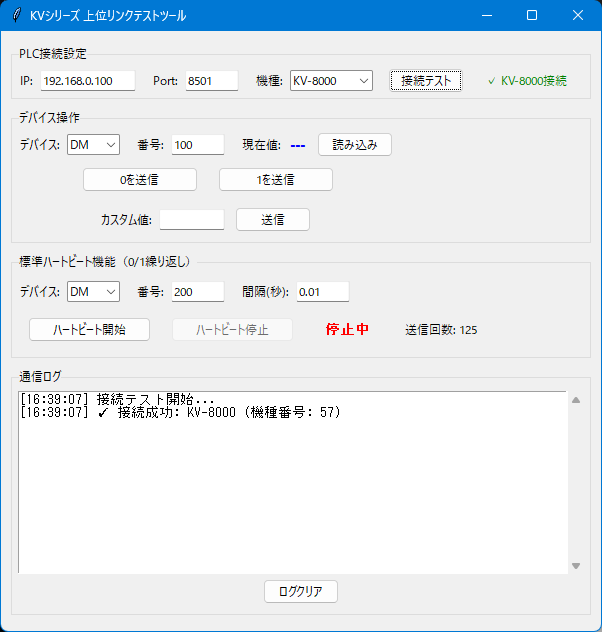

# TA_Keyence_Alive_Checker

KEYENCEのKVシリーズPLCと上位リンク通信を行うためのPythonツールです。  
Tkinterを使用したGUIから、デバイス読み書きやハートビート機能を簡単に操作できます。

## 🧩 主な機能

- **KVシリーズPLC接続テスト** - KV-5000/7000/8000シリーズの接続確認
- **デバイス読み書き** - DM、W、R、MRデバイスの値読み取り・書き込み
- **ハートビート機能** - 0/1を繰り返し送信する生存確認機能
- **リアルタイムログ** - 全ての通信履歴をタイムスタンプ付きで表示

## 💻 動作環境

- Python 3.6+
- Windows/Linux/macOS
- 標準ライブラリのみ使用（tkinter, socket, threading）

## 📦 インストール方法

bash

```bash
# リポジトリをクローン
git clone https://github.com/Li-Wang-Tom/TA_Keyence_Alive_Checker.git
cd TA_Keyence_Alive_Checker

# アプリケーションを起動
python TA_Keyence_Alive_Checker.py
```

## 🚀 使用方法

1. **アプリケーションを起動**
2. **PLC接続設定**
   - IP Address（例: 192.168.0.100）
   - Port番号（例: 8501）
   - 機種選択（KV-5000/7000/8000）
3. **「接続テスト」で通信確認**
4. **デバイス操作**
   - デバイス種別選択（DM/W/R/MR）
   - デバイス番号入力
   - 読み込み・書き込み実行
5. **ハートビート機能**
   - 対象デバイス設定
   - 送信間隔設定
   - 開始・停止操作

## 🖼️ アプリ画面



## 🔧 主な技術

- **TCP/IP Socket通信** - PLCとの直接通信
- **KEYENCEプロトコル** - 上位リンクコマンド処理
- **マルチスレッド処理** - GUI応答性とハートビート同時実行
- **Tkinter GUI** - 直感的なユーザーインターフェース

## 🎯 対応PLC機種

- **KV-5000シリーズ** (機種番号: 55)
- **KV-7000シリーズ** (機種番号: 56)
- **KV-8000シリーズ** (機種番号: 57)

## 🛠️ 開発者向け情報

### ファイル構成

```
TA_Keyence_Alive_Checker/
├─ TA_Keyence_Alive_Checker.py        # メインアプリケーション
├─ README.md                          # このファイル
├─ LICENSE                            # ライセンス
├─ TA_icon.ico                        # アプリケーションアイコン
└─ docs/                              # ドキュメント
   └─ screenshot.png                  # スクリーンショット
```

### 主要クラス・関数

- `PLCControlGUI` - メインアプリケーションクラス
- `plc_command()` - PLC通信実行
- `test_connection()` - 接続テスト
- `heartbeat_worker()` - ハートビート送信

### 通信プロトコル

- **接続確認**: `?K\r` → 機種番号応答
- **デバイス読込**: `RD {デバイス}\r` → 値応答
- **デバイス書込**: `WR {デバイス} {値}\r` → OK応答

## 🚨 注意事項

- PLCの設定で上位リンク機能を有効にしてください
- ネットワーク設定でPLCとの通信が可能な状態にしてください
- ハートビート使用時は適切な間隔を設定してください（推奨: 1秒以上）
- 本ツールは開発・テスト用途での使用を想定しています

## 🤝 貢献方法

1. フォークしてください
2. フィーチャーブランチを作成（`git checkout -b feature/amazing-feature`）
3. 変更をコミット（`git commit -m 'Add amazing feature'`）
4. ブランチにプッシュ（`git push origin feature/amazing-feature`）
5. プルリクエストを作成

## 📝 License

This project is licensed under the MIT License.  
See the [LICENSE](LICENSE) file for details.

## 👨‍💻 作者

**TA Li-Wang-Tom**

- GitHub: [@Li-Wang-Tom](https://github.com/Li-Wang-Tom)

## 🙏 謝辞

このプロジェクトは以下の優れたライブラリとコミュニティの支援により実現されました：

- **Python コミュニティ** - 強力なプログラミング言語を提供
- **Tkinter 開発チーム** - クロスプラットフォームGUIライブラリ
- **KEYENCE** - 優れたPLC製品
- **GitHub** - オープンソースプロジェクトの完璧なホスティング
- **Stack Overflow コミュニティ** - 開発過程での無数のサポート

オープンソース事業に貢献するすべての開発者に感謝します。

皆さんの努力なしには、このプロジェクトは生まれませんでした。

ありがとうございます！🎉

本项目的开发离不开以下优秀的开源项目和社区支持：

- **Python 社区** - 为我们提供了强大的编程语言
- **Tkinter 开发团队** - 提供了跨平台GUI库
- **KEYENCE** - 提供了优秀的PLC
- **GitHub** - 为开源项目提供了完美的托管平台
- **Stack Overflow 社区** - 在开发过程中提供了无数帮助

感谢所有为开源事业贡献力量的开发者们！

没有你们的努力，就没有这个项目的诞生。

谢谢大家！🎉
